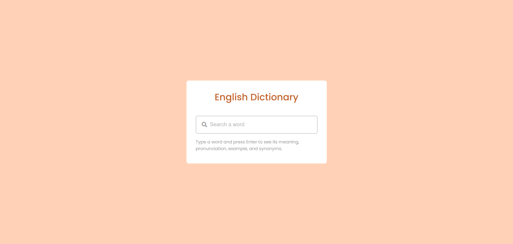
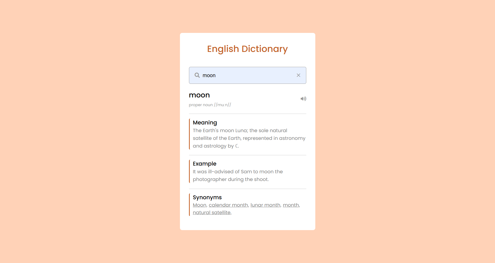
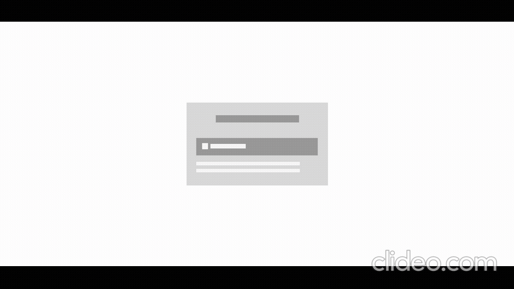
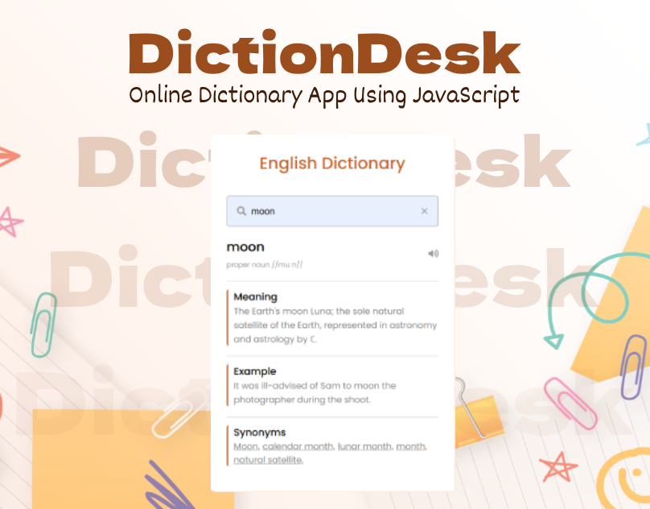

# 📚 DictionDesk

**DictionDesk** is a sleek and simple online dictionary app built using **HTML, CSS, and Vanilla JavaScript**. It allows users to search for any English word and view its **definition, example usage, phonetics, synonyms**, and more — all in real-time.

---

## 🚀 Features

- 🔍 Search for any English word
- 📖 View word definitions, phonetics, and usage examples
- 🧠 Get synonyms to expand your vocabulary
- 🎨 Clean and responsive UI
- ⚡ Built with Vanilla JavaScript (no libraries/frameworks)

---

## 🛠️ Tech Stack

- **HTML5** – Markup structure
- **CSS3** – Styling and layout
- **JavaScript (Vanilla)** – Core functionality and API integration
- **Dictionary API** – For fetching word data  
  API Source: [https://dictionaryapi.dev](https://dictionaryapi.dev)

---

 
Desktop Design 

 
Desktop Hover Effect Design  

 
Desktop Design 

 
Desktop UI UX Layout  

 
Cover 
